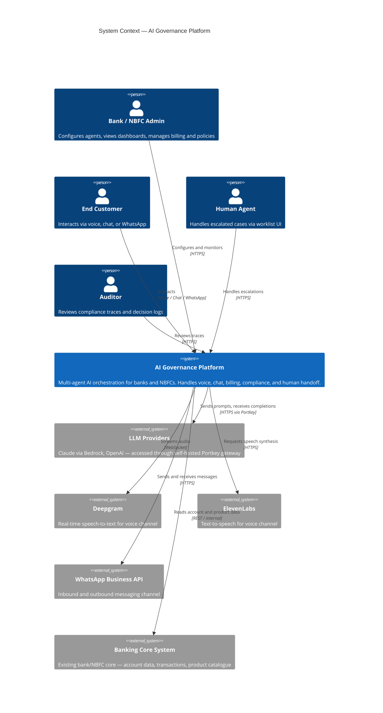

# Governance Platform — C4 Diagrams

## Level 1: System Context

```mermaid
C4Context
  title System Context — AI Governance Platform

  Person(admin, "Bank / NBFC Admin", "Configures agents, views dashboards, manages billing and policies")
  Person(customer, "End Customer", "Interacts via voice, chat, or WhatsApp")
  Person(agent, "Human Agent", "Handles escalated cases via worklist UI")
  Person(auditor, "Auditor", "Reviews compliance traces and decision logs")

  System(platform, "AI Governance Platform", "Multi-agent AI orchestration for banks and NBFCs. Handles voice, chat, billing, compliance, and human handoff.")

  System_Ext(llm, "LLM Providers", "Claude via Bedrock, OpenAI — accessed through self-hosted Portkey gateway")
  System_Ext(deepgram, "Deepgram", "Real-time speech-to-text for voice channel")
  System_Ext(elevenlabs, "ElevenLabs", "Text-to-speech for voice channel")
  System_Ext(whatsapp, "WhatsApp Business API", "Inbound and outbound messaging channel")
  System_Ext(cbs, "Banking Core System", "Existing bank/NBFC core — account data, transactions, product catalogue")

  Rel(admin, platform, "Configures and monitors", "HTTPS")
  Rel(customer, platform, "Interacts", "Voice / Chat / WhatsApp")
  Rel(agent, platform, "Handles escalations", "HTTPS")
  Rel(auditor, platform, "Reviews traces", "HTTPS")
  Rel(platform, llm, "Sends prompts, receives completions", "HTTPS via Portkey")
  Rel(platform, deepgram, "Streams audio", "WebSocket")
  Rel(platform, elevenlabs, "Requests speech synthesis", "HTTPS")
  Rel(platform, whatsapp, "Sends and receives messages", "HTTPS")
  Rel(platform, cbs, "Reads account and product data", "REST / internal")
```

## Level 2: Container

```mermaid
C4Container
  title Container Diagram — AI Governance Platform

  Person(customer, "End Customer", "Voice / Chat / WhatsApp")
  Person(admin, "Admin / Agent / Auditor", "Web browser")

  System_Boundary(platform, "AI Governance Platform") {
    Container(gateway, "API Gateway", "Kong OSS", "Single entry point — rate limiting, auth enforcement, routing")
    Container(auth, "Identity Service", "Keycloak", "Authentication and RBAC for all actors")
    Container(channel, "Channel Gateway", "Python / FastAPI", "Adapters for LiveKit voice, WhatsApp, SMS. Normalises all input to a canonical event.")
    Container(orchestrator, "Agent Orchestrator", "Java / Spring Boot", "Routes requests to the right agent. Manages conversation state, turn-taking, timeout policies.")
    Container(llm_manager, "LLM Manager", "Python / FastAPI", "Portkey AI Gateway + Presidio PII pipeline. HMAC-SHA256 hashing, AES-256-CBC vault. Langfuse trace emission.")
    Container(handoff, "Human Handoff Service", "Java / Spring Boot", "Worklist for human agents. Escalation triggers, SLA timers, resolution tracking.")
    Container(billing, "Billing Service", "Java / Spring Boot", "Per-tenant metered billing. Token consumption, channel usage, per-decision cost.")
    Container(audit, "Audit Service", "Java / Spring Boot", "Aggregates compliance traces. Regulator-facing decision log. Append-only.")

    ContainerDb(kafka, "Event Bus", "Kafka 3.9 KRaft", "Durable async backbone. All inter-service events and Langfuse trace pipeline.")
    ContainerDb(redis, "Cache / Session", "Redis", "Hot conversation state, rate limit counters, idempotency keys.")
    ContainerDb(postgres, "Operational DB", "PostgreSQL", "Tenants, agents, policies, billing records, worklist items.")
    ContainerDb(mongo, "PII Vault", "MongoDB", "AES-256-CBC encrypted PII store. TTL expiry. Auditor-only reveal.")
    ContainerDb(vault, "Secrets", "HashiCorp Vault", "API keys, encryption keys, service credentials.")
  }

  System_Ext(llm, "LLM Providers", "Bedrock / OpenAI")
  System_Ext(observability, "Observability Stack", "Langfuse + OpenTelemetry + Grafana")

  Rel(customer, gateway, "Connects", "WebSocket / HTTPS")
  Rel(admin, gateway, "Manages", "HTTPS")
  Rel(gateway, auth, "Validates token", "HTTPS")
  Rel(gateway, channel, "Routes inbound", "internal")
  Rel(channel, kafka, "Publishes conversation events", "Kafka topic")
  Rel(orchestrator, kafka, "Consumes events, publishes decisions", "Kafka topic")
  Rel(orchestrator, llm_manager, "Requests LLM calls", "HTTP")
  Rel(orchestrator, handoff, "Triggers escalation", "HTTP")
  Rel(llm_manager, llm, "Sends prompts", "HTTPS")
  Rel(llm_manager, mongo, "Reads/writes PII vault", "internal")
  Rel(llm_manager, kafka, "Emits Langfuse traces", "Kafka topic")
  Rel(billing, kafka, "Consumes usage events", "Kafka topic")
  Rel(audit, kafka, "Consumes all events", "Kafka topic")
  Rel(orchestrator, redis, "Session state", "internal")
  Rel(orchestrator, postgres, "Agent config, policies", "internal")
  Rel(vault, llm_manager, "Provides secrets", "internal")
  Rel(kafka, observability, "Trace pipeline", "Kafka consumer")
```
